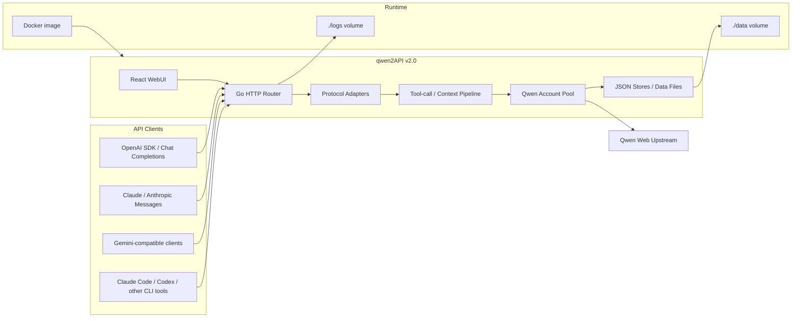

# qwen2API

<p align="center">
  
  
  
  
  
</p>

<p align="center">
  <b>自托管千问 Web 协议转换网关</b><br />
  OpenAI / Anthropic / Gemini 兼容接口，账号池，WebUI，文件上下文，图片和视频生成。
</p>

<p align="center">
  <a href="./README_EN.md">English</a>
  ·
  <a href="https://hub.docker.com/r/yujunzhixue/qwen2api">Docker Hub</a>
  ·
  <a href="https://t.me/qwen2api">Telegram</a>
</p>

## 版本说明

| 版本 | 技术栈 | 状态 |
|---|---|---|
| `v1.0` | Python + FastAPI/Uvicorn | 旧版实现，仅保留为历史说明。 |
| `v2.0` | Go 后端 + React WebUI | 当前主线，启动更快，部署更简单，Docker 优先。 |

## 能力概览

- OpenAI：`/v1/chat/completions`、`/v1/responses`、`/v1/models`、`/v1/files`、`/v1/images/generations`、`/v1/videos/generations`
- Anthropic：`/v1/messages`、`/anthropic/v1/messages`、`/v1/messages/count_tokens`
- Gemini：`/v1beta/models/{model}:generateContent`、`:streamGenerateContent`
- WebUI：账号管理、API Key 管理、运行设置、模型测试、图片测试、视频测试
- 账号池：多账号轮询、单账号并发、对话/图片/视频分用途限额冷却
- 运维：`/healthz`、`/readyz`、`/keepalive`、Docker Healthcheck、GitHub Actions 多架构镜像

## 架构



`./data` 是持久化状态，`./logs` 是运行日志。Docker 内部固定使用 `/app/data` 和 `/app/logs`，默认映射到宿主机当前目录的 `./data` 和 `./logs`。

## Docker 部署

### 方式 A：Docker Hub 拉取

```bash
mkdir qwen2api
cd qwen2api
mkdir -p data logs
curl -fsSL -o docker-compose.yml https://raw.githubusercontent.com/YuJunZhiXue/qwen2API/main/docker-compose.yml
curl -fsSL -o .env.example https://raw.githubusercontent.com/YuJunZhiXue/qwen2API/main/.env.example
cp .env.example .env
```

编辑 `.env`，至少填写：

```env
HOST_PORT=7860
HOST_DATA_DIR=./data
HOST_LOGS_DIR=./logs
ADMIN_KEY=change-this-to-a-strong-random-key
```

启动：

```bash
docker compose up -d
docker compose logs -f qwen2api
```

访问：

- WebUI：`http://127.0.0.1:7860`
- 健康检查：`http://127.0.0.1:7860/healthz`
- 保活探针：`http://127.0.0.1:7860/keepalive`

### 方式 B：本地 Docker 编译

```bash
git clone https://github.com/YuJunZhiXue/qwen2API.git
cd qwen2API
cp .env.example .env
docker compose -f docker-compose.yml -f docker-compose.build.yml build
docker compose -f docker-compose.yml -f docker-compose.build.yml up -d
```

### 方式 C：GitHub Actions 打包 Docker

仓库已包含 `.github/workflows/docker-publish.yml`：

- push 到 `main` 时构建 `latest` 和 `sha-*` 标签。
- push `v*.*.*` tag 时构建版本标签。
- 默认推送 GHCR：`ghcr.io/yujunzhixue/qwen2api`。
- 配置 `DOCKERHUB_USERNAME` 和 `DOCKERHUB_TOKEN` 后同时推送 Docker Hub：`yujunzhixue/qwen2api`。

## 本地开发运行

```powershell
go run start-all.go
```

或分别启动：

```powershell
cd backend
go run .
```

```powershell
cd frontend
npm ci
npm run dev
```

验证：

```powershell
cd backend
go test ./...
go build -trimpath -ldflags="-s -w" -o ..\bin\qwen2api-backend.exe .
```

```powershell
cd frontend
npm run build
```

## 配置说明

关键配置都在 `.env.example` 中有空值或注释示例。仓库示例不会包含真实 Key、Token、Cookie 或密码。

| 变量 | 说明 |
|---|---|
| `ADMIN_KEY` | WebUI 和 `/api/admin/*` 管理接口认证 Key，必须自行设置强随机值。 |
| `QWEN_API_KEY` / `QWEN_API_KEYS` / `QWEN_API_KEY_N` | 从环境变量注入下游 API Key，不写入 `data/api_keys.json`，不能在 WebUI 删除。 |
| `QWEN_ACCOUNT_N` | 从环境变量注入上游账号，格式为 `token;optional-email;optional-password`，不写入 `data/accounts.json`。 |
| `KEEPALIVE_URL` / `KEEPALIVE_INTERVAL` | 后台保活任务。环境变量存在时会锁定 WebUI 中对应字段。 |
| `HOST_DATA_DIR` / `HOST_LOGS_DIR` | Docker 宿主机数据和日志目录，默认当前目录下的 `./data`、`./logs`。 |
| `DATA_DIR` / `LOGS_DIR` | 本地非 Docker 运行路径覆盖。留空时使用当前项目目录。Docker 中由 compose 固定为 `/app/data`、`/app/logs`。 |

## 数据文件

默认文件位置：

- `data/accounts.json`：WebUI 添加的上游账号。
- `data/api_keys.json`：WebUI 创建的下游 API Key。
- `data/config.json`：运行配置，例如 keepalive。
- `data/context_files/`：上下文生成文件。
- `logs/`：运行日志。

环境变量注入的账号和 Key 只存在于运行时，不会写回 JSON 文件。

## 当前限制

- `v2.0` 不再保留 Python FastAPI 后端入口。
- 旧版“一键获取新号”不属于当前 Go 主线能力。
- OpenAI Assistants/Realtime/Audio/Fine-tuning 等完整生态接口未实现。
- 图片和视频限额来自 Qwen 账号自身额度；对话正常不代表图片或视频额度也可用。

## License

GPL-3.0
