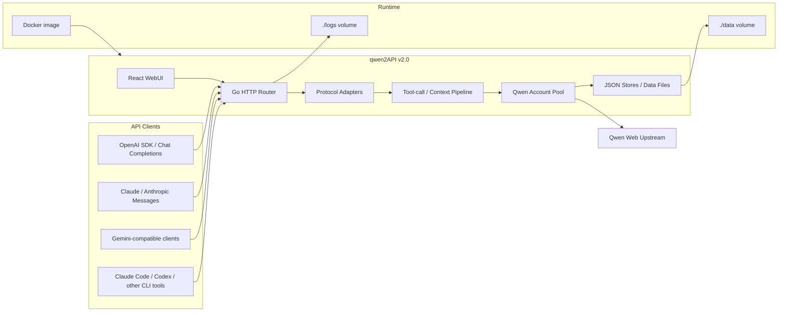

# qwen2API

<p align="center">
  
  
  
  
  
  
</p>

<p align="center">
  <b>Self-hosted Qwen Web protocol gateway</b><br />
  OpenAI / Anthropic / Gemini compatible APIs, account pool, WebUI, file context, image and video generation.
</p>

<p align="center">
  <a href="./README_CN.md">中文</a>
  ·
  <a href="https://t.me/qwen2api">Telegram Group</a>
  ·
  <a href="https://hub.docker.com/r/yujunzhixue/qwen2api">Docker Hub</a>
</p>

## Version Notes

| Version | Stack | Status |
|---|---|---|
| `v1.0` | Python backend + FastAPI/Uvicorn | Legacy implementation. Kept as historical reference. |
| `v2.0` | Go backend + React WebUI | Current implementation. Faster startup, simpler deployment, Docker-first runtime. |

## What It Does

qwen2API converts Qwen Web-side capabilities into common API protocols:

- OpenAI Chat Completions: `POST /v1/chat/completions`
- OpenAI Responses: `POST /v1/responses`
- Anthropic Messages: `POST /v1/messages`
- Gemini GenerateContent: `POST /v1beta/models/{model}:generateContent`
- Models: `GET /v1/models`
- Images: `POST /v1/images/generations`
- Videos: `POST /v1/videos/generations`
- Files: `POST /v1/files`
- Admin WebUI: `/`
- Health checks: `/healthz`, `/readyz`

The WebUI can manage Qwen accounts, client API keys, runtime settings, model tests, image tests, and video tests.

## Architecture



Runtime notes:

- `Go HTTP Router` exposes OpenAI, Anthropic, Gemini, admin, file, image, video, and health endpoints.
- `Protocol Adapters` normalize different client protocols into the internal request flow.
- `Tool-call / Context Pipeline` handles CLI tool-call formatting, file context, uploaded files, and workspace reminders.
- `Qwen Account Pool` selects usable upstream accounts and applies concurrency/rate-limit controls.
- `./data` is persistent state. `./logs` is runtime output. Both are mounted into the container.

## Docker Deployment

Docker is the recommended deployment path for `v2.0`.

### Path A: Pull From Docker Hub

Use this path on servers. It pulls the prebuilt multi-architecture image from Docker Hub.

#### 1. Prepare A Directory

```bash
mkdir qwen2api
cd qwen2api
mkdir -p data logs
```

#### 2. Create `.env`

Set a strong `ADMIN_KEY` locally before starting the container. This key is only for the WebUI/admin API. Create client API keys later in the WebUI. Do not commit the real value.

```env
HOST_PORT=7860
QWEN2API_IMAGE=
HOST_DATA_DIR=./data
HOST_LOGS_DIR=./logs
ADMIN_KEY=
PORT=7860
LOG_LEVEL=INFO
BROWSER_POOL_SIZE=1
MAX_INFLIGHT_PER_ACCOUNT=2
```

Optional advanced settings are listed in `.env.example` in this repository.

#### 3. Create `docker-compose.yml`

```yaml
services:
  qwen2api:
    image: ${QWEN2API_IMAGE:-yujunzhixue/qwen2api:latest}
    container_name: qwen2api
    restart: unless-stopped
    init: true
    env_file:
      - .env
    ports:
      - "${HOST_PORT:-7860}:${PORT:-7860}"
    volumes:
      - ${HOST_DATA_DIR:-./data}:/app/data
      - ${HOST_LOGS_DIR:-./logs}:/app/logs
    shm_size: "512m"
    environment:
      BASE_DIR: /app
      DATA_DIR: /app/data
      LOGS_DIR: /app/logs
      ACCOUNTS_FILE: /app/data/accounts.json
      USERS_FILE: /app/data/users.json
      CAPTURES_FILE: /app/data/captures.json
      CONFIG_FILE: /app/data/config.json
      API_KEYS_FILE: /app/data/api_keys.json
      CONTEXT_GENERATED_DIR: /app/data/context_files
      CONTEXT_CACHE_FILE: /app/data/context_cache.json
      UPLOADED_FILES_FILE: /app/data/uploaded_files.json
      CONTEXT_AFFINITY_FILE: /app/data/session_affinity.json
    healthcheck:
      test: ["CMD-SHELL", "curl -fsS http://127.0.0.1:${PORT:-7860}/healthz || exit 1"]
      interval: 30s
      timeout: 10s
      start_period: 120s
      retries: 3
```

Important:

- `./data` stores accounts, API keys, settings, uploaded-file metadata, and context cache. Do not delete it during upgrades.
- `./data` can be empty on first start. The service creates runtime state when you add accounts or generate API keys.
- To reuse an existing data directory, set `HOST_DATA_DIR` to that host path. Do not set Docker `DATA_DIR` to a host path.
- On Windows, prefer forward slashes in `.env`, for example `HOST_DATA_DIR=E:/qwen2API/data`.
- `./logs` stores runtime logs.
- `/app/data` and `/app/logs` are internal container storage paths only. They are not injected into model prompts as the user's workspace.
- Keep `shm_size: "512m"` for browser automation stability.
- Fill `ADMIN_KEY` in your local `.env`; the repository intentionally does not include any usable admin key.
- Runtime settings are read from `.env`. Compose only fixes container-internal data paths so host paths are not passed into the container by mistake.
- Local `data/` is excluded from the Docker build context and is never baked into the published image.

#### 4. Start

```bash
docker compose pull
docker compose up -d
docker compose logs -f qwen2api
```

Check:

```bash
curl -fsS http://127.0.0.1:7860/healthz
```

Open:

- WebUI: `http://127.0.0.1:7860/`
- API base: `http://127.0.0.1:7860/v1`

#### 5. Upgrade

```bash
docker compose pull
docker compose up -d
docker image prune -f
```

### Path B: Build Locally

Use this path when you changed code locally and want to run your own image on the same machine.

From this repository:

```bash
docker compose -f docker-compose.yml -f docker-compose.build.yml build
docker compose -f docker-compose.yml -f docker-compose.build.yml up -d
```

For a one-shot build and start:

```bash
docker compose -f docker-compose.yml -f docker-compose.build.yml up -d --build
```

The build uses:

- Node stage to build `frontend/dist`.
- Go stage to compile the backend binary.
- Debian runtime stage with browser dependencies.

### Path C: GitHub Actions Build And Push

Use this path when you want every push or tag to build Docker images automatically.

The repository includes `.github/workflows/docker-publish.yml`.

It currently does:

- Trigger on `main` branch pushes, `v*.*.*` tags, or manual `workflow_dispatch`.
- Build multi-architecture images for `linux/amd64` and `linux/arm64`.
- Push to GitHub Container Registry: `ghcr.io/yujunzhixue/qwen2api`.
- Push to Docker Hub: `yujunzhixue/qwen2api`, only when Docker Hub secrets are configured.
- Tag `latest` on the default branch, semantic versions on Git tags, and short SHA tags.

Optional repository secrets for Docker Hub publishing:

| Secret | Purpose |
|---|---|
| `DOCKERHUB_USERNAME` | Docker Hub username. |
| `DOCKERHUB_TOKEN` | Docker Hub access token. |

If these two secrets are not configured, the workflow still builds and pushes GHCR images.

Release flow:

```bash
git add .
git commit -m "release: v2.0.0"
git tag v2.0.0
git push origin main --tags
```

Then check the Actions page. After the workflow succeeds, servers can update with:

```bash
docker compose pull
docker compose up -d
```

### Docker Troubleshooting

| Symptom | Check |
|---|---|
| Container exits immediately | Run `docker compose logs -f qwen2api`; check `ADMIN_KEY`, port conflicts, and data permissions. |
| `/healthz` is unreachable | Run `docker compose ps`; wait for startup or inspect logs. |
| WebUI is blank | Confirm the image is complete or rebuild frontend assets locally. |
| Browser automation fails | Keep `shm_size: "512m"` and prefer the published image. |
| Data disappears after update | Confirm `./data:/app/data` exists in Compose. |

## Local Development

One-command dev startup:

```bash
go run start-all.go
```

Backend only:

```bash
cd backend
go run .
```

Frontend only:

```bash
cd frontend
npm install
npm run dev
```

Verification:

```bash
cd backend
go test ./...
go vet ./...
go build ./...

cd ../frontend
npm run build
```

## Client Examples

OpenAI-compatible chat:

```bash
curl http://127.0.0.1:7860/v1/chat/completions \
  -H "Authorization: Bearer YOUR_CLIENT_API_KEY" \
  -H "Content-Type: application/json" \
  -d '{
    "model": "qwen3.6-plus",
    "messages": [{"role": "user", "content": "Hello"}],
    "stream": true
  }'
```

Anthropic-compatible messages:

```bash
curl http://127.0.0.1:7860/v1/messages \
  -H "Authorization: Bearer YOUR_CLIENT_API_KEY" \
  -H "Content-Type: application/json" \
  -d '{
    "model": "qwen3.6-plus",
    "max_tokens": 1024,
    "messages": [{"role": "user", "content": "Hello"}]
  }'
```

Image generation:

```bash
curl http://127.0.0.1:7860/v1/images/generations \
  -H "Authorization: Bearer YOUR_CLIENT_API_KEY" \
  -H "Content-Type: application/json" \
  -d '{
    "model": "qwen3.6-plus",
    "prompt": "A cyberpunk cat under neon lights",
    "size": "1328x1328",
    "n": 1
  }'
```

## Current Limits

- One-click new Qwen account registration from the old Python version is not implemented in Go `v2.0`.
- Embeddings are compatibility placeholders with deterministic simulated vectors, not native Qwen embeddings.
- Full OpenAI Assistants/Threads/Runs, Realtime, Audio, Batch, Fine-tuning, and Vector Stores are not implemented.
- OpenAI Files support is limited to this project's context attachment pipeline.

## License

GPL-3.0.

This project is intended for protocol compatibility, interface conversion, automated testing, and personal technical research. It does not provide officially authorized Tongyi Qianwen commercial API services.
