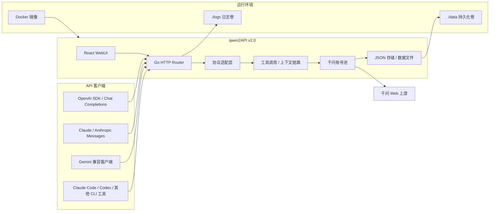

# qwen2API

<p align="center">
  
  
  
  
  
  
</p>

<p align="center">
  <b>自托管千问 Web 协议转换网关</b><br />
  OpenAI / Anthropic / Gemini 兼容接口，账号池，WebUI，文件上下文，图片和视频生成。
</p>

<p align="center">
  <a href="./README.md">English</a>
  ·
  <a href="https://t.me/qwen2api">Telegram 群聊</a>
  ·
  <a href="https://hub.docker.com/r/yujunzhixue/qwen2api">Docker Hub</a>
</p>

## 版本说明

| 版本 | 技术栈 | 状态 |
|---|---|---|
| `v1.0` | Python 后端 + FastAPI/Uvicorn | 旧版实现，仅作为历史版本说明。 |
| `v2.0` | Go 后端 + React WebUI | 当前实现，启动更快，部署更简单，优先面向 Docker 运行。 |

## 项目作用

qwen2API 将千问 Web 侧能力转换为常见 API 协议：

- OpenAI Chat Completions：`POST /v1/chat/completions`
- OpenAI Responses：`POST /v1/responses`
- Anthropic Messages：`POST /v1/messages`
- Gemini GenerateContent：`POST /v1beta/models/{model}:generateContent`
- 模型列表：`GET /v1/models`
- 图片生成：`POST /v1/images/generations`
- 视频生成：`POST /v1/videos/generations`
- 文件上传：`POST /v1/files`
- 管理台 WebUI：`/`
- 健康检查：`/healthz`、`/readyz`

WebUI 支持千问账号管理、客户端 API Key、运行设置、模型测试、图片测试和视频测试。

## 架构



运行说明：

- `Go HTTP Router` 暴露 OpenAI、Anthropic、Gemini、管理、文件、图片、视频和健康检查接口。
- `协议适配层` 将不同客户端协议统一成内部请求流程。
- `工具调用 / 上下文链路` 处理 CLI 工具调用格式、文件上下文、上传文件和 workspace 提醒。
- `千问账号池` 选择可用上游账号，并执行并发控制和限流冷却。
- `./data` 是持久化状态，`./logs` 是运行日志，两者都通过 Docker volume 挂载。

## Docker 部署

`v2.0` 推荐使用 Docker 部署。

### 路线 A：从 Docker Hub 拉取

服务器部署推荐使用这条路线，直接拉取已经构建好的多架构镜像。

#### 1. 准备目录

```bash
mkdir qwen2api
cd qwen2api
mkdir -p data logs
```

#### 2. 创建 `.env`

启动容器前，请在本机 `.env` 里填写强随机 `ADMIN_KEY`。它只用于 WebUI / 管理接口登录，客户端调用用的 API Key 启动后在 WebUI 里创建。真实值不要提交到仓库。

```env
HOST_PORT=7860
QWEN2API_IMAGE=
HOST_DATA_DIR=./data
HOST_LOGS_DIR=./logs
ADMIN_KEY=
PORT=7860
LOG_LEVEL=INFO
BROWSER_POOL_SIZE=1
MAX_INFLIGHT_PER_ACCOUNT=2
```

更多高级配置见仓库里的 `.env.example`。

#### 3. 创建 `docker-compose.yml`

```yaml
services:
  qwen2api:
    image: ${QWEN2API_IMAGE:-yujunzhixue/qwen2api:latest}
    container_name: qwen2api
    restart: unless-stopped
    init: true
    env_file:
      - .env
    ports:
      - "${HOST_PORT:-7860}:${PORT:-7860}"
    volumes:
      - ${HOST_DATA_DIR:-./data}:/app/data
      - ${HOST_LOGS_DIR:-./logs}:/app/logs
    shm_size: "512m"
    environment:
      BASE_DIR: /app
      DATA_DIR: /app/data
      LOGS_DIR: /app/logs
      ACCOUNTS_FILE: /app/data/accounts.json
      USERS_FILE: /app/data/users.json
      CAPTURES_FILE: /app/data/captures.json
      CONFIG_FILE: /app/data/config.json
      API_KEYS_FILE: /app/data/api_keys.json
      CONTEXT_GENERATED_DIR: /app/data/context_files
      CONTEXT_CACHE_FILE: /app/data/context_cache.json
      UPLOADED_FILES_FILE: /app/data/uploaded_files.json
      CONTEXT_AFFINITY_FILE: /app/data/session_affinity.json
    healthcheck:
      test: ["CMD-SHELL", "curl -fsS http://127.0.0.1:${PORT:-7860}/healthz || exit 1"]
      interval: 30s
      timeout: 10s
      start_period: 120s
      retries: 3
```

重点说明：

- `./data` 保存账号、API Key、设置、上传文件元数据和上下文缓存，升级时不要删除。
- `./data` 首次启动可以是空目录。用户添加账号或生成 API Key 后，服务会写入运行状态文件。
- 要复用旧数据目录，请把 `HOST_DATA_DIR` 设置为宿主机旧 `data` 路径；不要把 Docker 里的 `DATA_DIR` 写成宿主机路径。
- Windows 下建议在 `.env` 里使用正斜杠路径，例如 `HOST_DATA_DIR=E:/千问2api/qwen/qwen2API/data`。
- `./logs` 保存运行日志。
- `/app/data` 和 `/app/logs` 只是容器内部存储路径，不会作为用户 workspace 注入模型提示词。
- 建议保留 `shm_size: "512m"`，浏览器自动化会更稳定。
- 请在本机 `.env` 填写 `ADMIN_KEY`，仓库示例故意不提供任何可直接使用的管理员密钥。
- 普通运行参数由 `.env` 生效；Compose 只固定容器内部数据路径，防止宿主机路径被传进容器。
- 本机 `data/` 已排除在 Docker build context 外，不会被打进发布镜像。

#### 4. 启动

```bash
docker compose pull
docker compose up -d
docker compose logs -f qwen2api
```

检查：

```bash
curl -fsS http://127.0.0.1:7860/healthz
```

访问：

- WebUI：`http://127.0.0.1:7860/`
- API Base：`http://127.0.0.1:7860/v1`

#### 5. 更新

```bash
docker compose pull
docker compose up -d
docker image prune -f
```

### 路线 B：本地构建镜像

适合你在本机改了代码，并且想直接运行自己的镜像。

在本仓库目录执行：

```bash
docker compose -f docker-compose.yml -f docker-compose.build.yml build
docker compose -f docker-compose.yml -f docker-compose.build.yml up -d
```

也可以一条命令构建并启动：

```bash
docker compose -f docker-compose.yml -f docker-compose.build.yml up -d --build
```

构建过程分三段：

- Node 阶段构建 `frontend/dist`。
- Go 阶段编译后端二进制。
- Debian 运行阶段安装浏览器依赖并运行服务。

### 路线 C：GitHub Actions 自动构建并推送

适合提交代码后自动打包 Docker 镜像，并推送到 Docker Hub / GHCR。

仓库已包含 `.github/workflows/docker-publish.yml`。

当前流程会：

- 在 `main` 分支 push、`v*.*.*` tag push 或手动 `workflow_dispatch` 时触发。
- 构建 `linux/amd64` 和 `linux/arm64` 多架构镜像。
- 推送到 GitHub Container Registry：`ghcr.io/yujunzhixue/qwen2api`。
- 推送到 Docker Hub：`yujunzhixue/qwen2api`，仅在 Docker Hub secrets 已配置时执行。
- 默认分支打 `latest`，版本 tag 打语义化版本，所有构建都会带短 SHA tag。

如需发布到 Docker Hub，需要在 GitHub 仓库 Secrets 配置：

| Secret | 用途 |
|---|---|
| `DOCKERHUB_USERNAME` | Docker Hub 用户名。 |
| `DOCKERHUB_TOKEN` | Docker Hub access token。 |

如果没有配置这两个 secrets，workflow 仍会构建并推送 GHCR 镜像。

发布流程示例：

```bash
git add .
git commit -m "release: v2.0.0"
git tag v2.0.0
git push origin main --tags
```

Actions 成功后，服务器更新：

```bash
docker compose pull
docker compose up -d
```

### Docker 常见问题

| 现象 | 检查 |
|---|---|
| 容器启动后退出 | 执行 `docker compose logs -f qwen2api`，检查 `ADMIN_KEY`、端口冲突和数据目录权限。 |
| `/healthz` 不通 | 执行 `docker compose ps`，等待启动完成或查看日志。 |
| WebUI 空白 | 确认镜像完整，或本地重新构建前端资产。 |
| 浏览器自动化失败 | 保留 `shm_size: "512m"`，优先使用发布镜像。 |
| 更新后数据丢失 | 确认 Compose 里保留 `./data:/app/data`。 |

## 本地开发

一键开发启动：

```bash
go run start-all.go
```

只启动后端：

```bash
cd backend
go run .
```

只启动前端：

```bash
cd frontend
npm install
npm run dev
```

验证：

```bash
cd backend
go test ./...
go vet ./...
go build ./...

cd ../frontend
npm run build
```

## 调用示例

OpenAI 兼容聊天：

```bash
curl http://127.0.0.1:7860/v1/chat/completions \
  -H "Authorization: Bearer YOUR_CLIENT_API_KEY" \
  -H "Content-Type: application/json" \
  -d '{
    "model": "qwen3.6-plus",
    "messages": [{"role": "user", "content": "你好"}],
    "stream": true
  }'
```

Anthropic 兼容消息：

```bash
curl http://127.0.0.1:7860/v1/messages \
  -H "Authorization: Bearer YOUR_CLIENT_API_KEY" \
  -H "Content-Type: application/json" \
  -d '{
    "model": "qwen3.6-plus",
    "max_tokens": 1024,
    "messages": [{"role": "user", "content": "你好"}]
  }'
```

图片生成：

```bash
curl http://127.0.0.1:7860/v1/images/generations \
  -H "Authorization: Bearer YOUR_CLIENT_API_KEY" \
  -H "Content-Type: application/json" \
  -d '{
    "model": "qwen3.6-plus",
    "prompt": "霓虹灯下的赛博朋克猫",
    "size": "1328x1328",
    "n": 1
  }'
```

## 当前限制

- Python `v1.0` 里的一键获取新千问账号功能，Go `v2.0` 当前未实现。
- Embeddings 是兼容占位实现，返回确定性模拟向量，不是千问原生 Embeddings。
- 不实现完整 OpenAI Assistants/Threads/Runs、Realtime、Audio、Batch、Fine-tuning、Vector Stores。
- OpenAI Files 只覆盖本项目上下文附件链路，不等同于官方完整文件生命周期。

## 许可证

GPL-3.0。

本项目用于协议兼容、接口转换、自动化测试与个人技术研究，不提供任何官方授权的通义千问商业接口服务。
