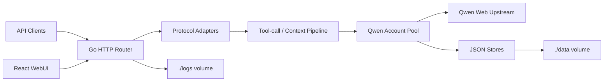

# qwen2API

Self-hosted Qwen Web protocol gateway.

`v1.0` was the legacy Python/FastAPI implementation. `v2.0` is the current Go backend with a React WebUI and Docker-first deployment.

## Features

- OpenAI-compatible Chat Completions, Responses, Models, Files, Images, and Videos endpoints.
- Anthropic-compatible Messages endpoints.
- Gemini-compatible GenerateContent and StreamGenerateContent endpoints.
- React WebUI for accounts, API keys, runtime settings, model tests, image tests, and video tests.
- Multi-account pool with per-account concurrency and per-usage chat/image/video rate-limit cooldowns.
- Docker health checks and `/healthz`, `/readyz`, `/keepalive` probes.

## Architecture



Docker uses `/app/data` and `/app/logs` inside the container. By default, compose mounts them from `./data` and `./logs` in the current host directory.

## Docker Hub

```bash
mkdir qwen2api
cd qwen2api
mkdir -p data logs
curl -fsSL -o docker-compose.yml https://raw.githubusercontent.com/YuJunZhiXue/qwen2API/main/docker-compose.yml
curl -fsSL -o .env.example https://raw.githubusercontent.com/YuJunZhiXue/qwen2API/main/.env.example
cp .env.example .env
```

Set at least a strong `ADMIN_KEY` in `.env`, then start:

```bash
docker compose up -d
docker compose logs -f qwen2api
```

## Local Docker Build

```bash
git clone https://github.com/YuJunZhiXue/qwen2API.git
cd qwen2API
cp .env.example .env
docker compose -f docker-compose.yml -f docker-compose.build.yml build
docker compose -f docker-compose.yml -f docker-compose.build.yml up -d
```

## GitHub Actions Docker Publishing

The repository includes `.github/workflows/docker-publish.yml`.

- Push to `main`: builds `latest` and `sha-*`.
- Push `v*.*.*` tags: builds semver tags.
- Pushes to GHCR by default.
- Also pushes to Docker Hub when `DOCKERHUB_USERNAME` and `DOCKERHUB_TOKEN` secrets are configured.

## Environment

Do not commit real secrets. `.env.example` intentionally contains empty values and commented examples only.

| Variable | Description |
|---|---|
| `ADMIN_KEY` | WebUI/admin API key. Set a strong private value. |
| `QWEN_API_KEY`, `QWEN_API_KEYS`, `QWEN_API_KEY_N` | Runtime-only downstream API keys injected from env. They are not saved to `data/api_keys.json`. |
| `QWEN_ACCOUNT_N` | Runtime-only upstream account, format `token;optional-email;optional-password`. |
| `KEEPALIVE_URL`, `KEEPALIVE_INTERVAL` | Optional background keepalive task. |
| `HOST_DATA_DIR`, `HOST_LOGS_DIR` | Host paths mounted into Docker as `/app/data` and `/app/logs`. |

## Local Development

```powershell
go run start-all.go
```

Backend verification:

```powershell
cd backend
go test ./...
go build -trimpath -ldflags="-s -w" -o ..\bin\qwen2api-backend.exe .
```

Frontend verification:

```powershell
cd frontend
npm ci
npm run build
```

## Limitations

- The Python/FastAPI backend entrypoint is no longer part of the Go v2.0 runtime.
- Legacy one-click account registration is not part of the current Go mainline.
- Qwen account quotas are usage-specific: chat may still work while image or video generation is quota-limited.

## License

GPL-3.0
